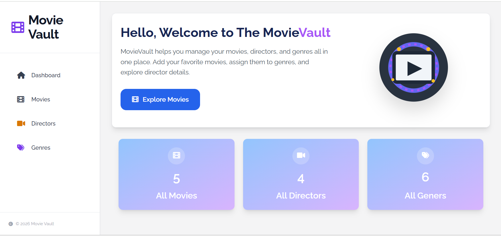
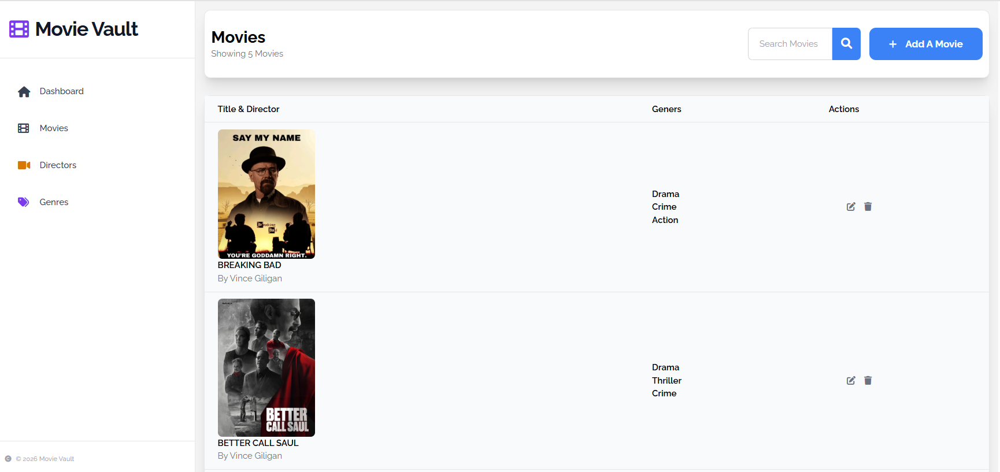
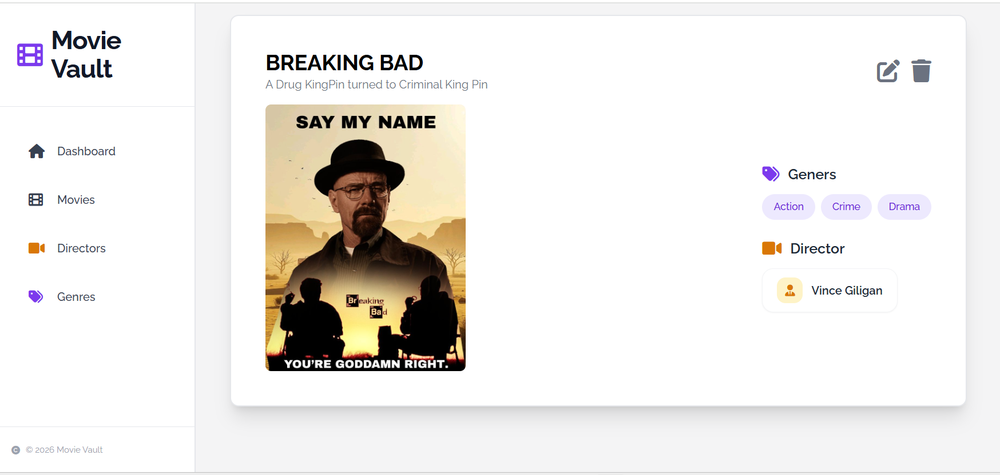
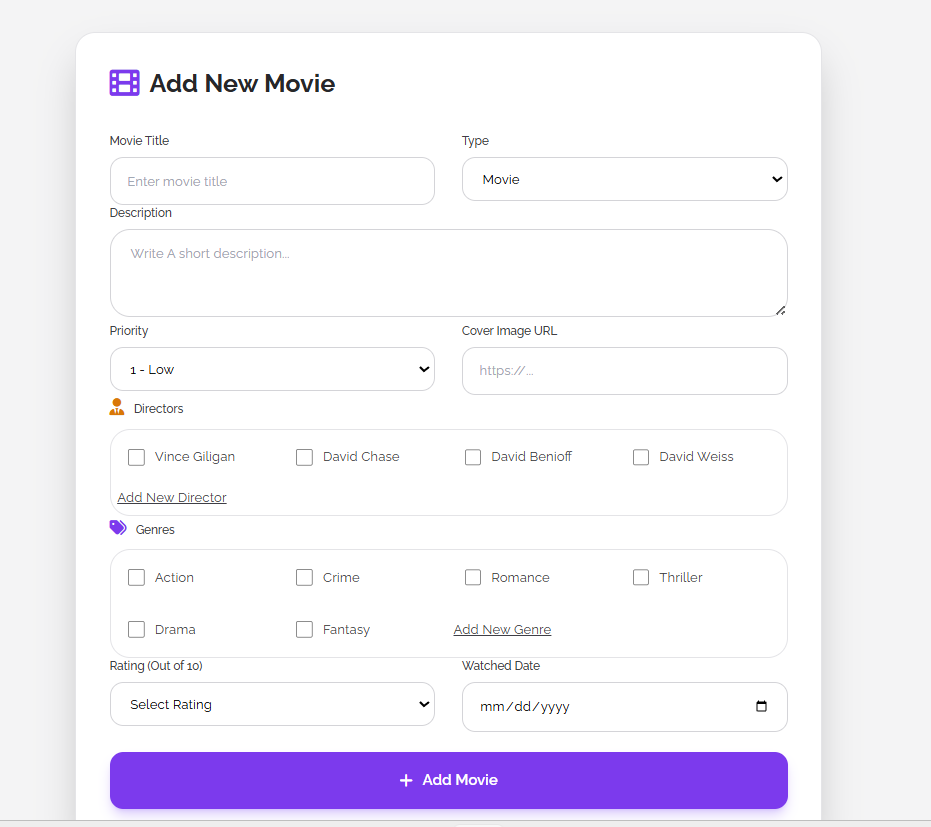
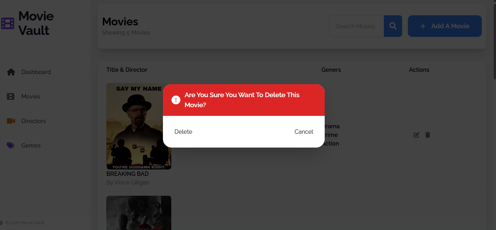

# 🎬 Movie Vault

A personal movie tracking app where you can log every movie, series, or documentary you've watched — or plan to watch. Add directors, assign genres, write a description, and keep your collection organized in one place.

I built this as part of [The Odin Project](https://www.theodinproject.com/) inventory application project, but ended up going well beyond the requirements because I actually wanted to use it. It started as a fun little project and turned into something I genuinely built for myself.

---

## Screenshots

### Dashboard


### Movies List


### Movie Detail Page


### Add New Movie


### Delete Confirmation


---

## Features

- Add movies, series, and documentaries to your vault
- Assign multiple genres per movie
- Link directors to movies (many-to-many)
- Edit any movie's details at any time
- Delete with a confirmation modal so you don't accidentally remove something
- Dashboard showing total count of movies, directors, and genres
- Search movies by title
- Cover image support via URL

---

## Tech Stack

- **Backend** — Node.js, Express
- **Database** — PostgreSQL
- **ORM** — Raw SQL with pg (node-postgres)
- **Templating** — EJS
- **Styling** — Tailwind CSS, Font Awesome
- **Deployment** — Render + Neon

---

## Getting Started

### Prerequisites

- Node.js installed
- PostgreSQL installed and running

### Installation

1. Clone the repo
```bash
git clone https://github.com/HaileabWolde/Inventary_App.git
cd Inventary_App
```

2. Install dependencies
```bash
npm install
```

3. Create a `.env` file in the root directory
```env
DATABASE_URL=your_postgresql_connection_string
```

4. Set up the database — run the SQL file to create all tables
```bash
psql -U postgres -d your_database_name -f SQLQUERY.sql
```

5. Start the server
```bash
node app.js
```

6. Open your browser and go to `http://localhost:3000`

---

## Database Schema

The app uses a relational PostgreSQL database with junction tables to handle the many-to-many relationships between movies, directors, and genres.

```
movies ──────── movie_director ──────── directors
   │
   └──────────── movie_genre ──────────── genres
```

---

## Live Demo

[Movie Vault on Render](https://your-app-name.onrender.com)

> Note: hosted on Render's free tier so it may take 30-40 seconds to wake up on first load.

---

## What I Learned

This project taught me more than any tutorial could. I ran into real bugs — a form action that wasn't being set properly, foreign key constraint errors from deleting in the wrong order, SQL injection vulnerabilities I had to go back and fix. Every problem I hit made me understand the underlying concepts better than reading about them ever would.

It's not perfect. But it works, it's deployed, and I built it myself.

---

## Author

**Haileab** — customer service agent at Ethiopian Airlines by day, developer in progress on days off.

- GitHub: [@HaileabWolde](https://github.com/HaileabWolde)